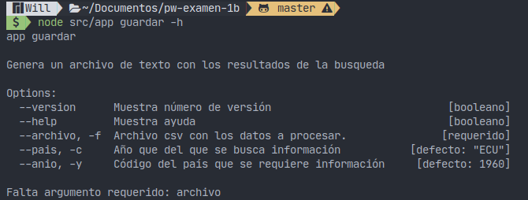
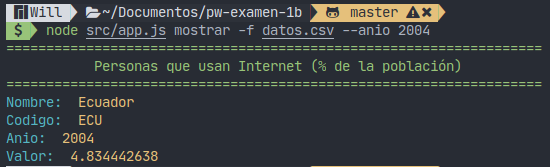
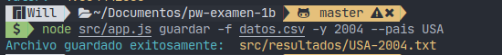
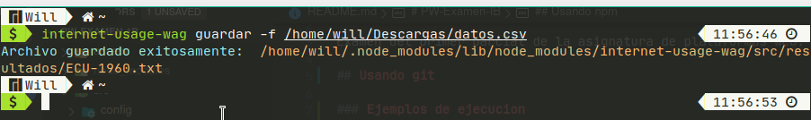

# PW-Examen-IB

Examen del primer parcial de la asignatura de plataformas web.

## Usando git

### Ejemplos de ejecucion

`node src/app.js mostrar -h`

`node src/app.js guardar -h`

`node app.js mostrar -f datos.csv --anio 2004`

`node src/app.js guardar -f datos.csv -y 2004 --pais USA`

## Usando npm 

Tambien se subio a npm para un uso mucho mas facil. Puedes ir al proyecto en npm aqui: <https://www.npmjs.com/package/internet-usage-wag>

### Ejemplo de uso 

`internet-usage-wag --help`

